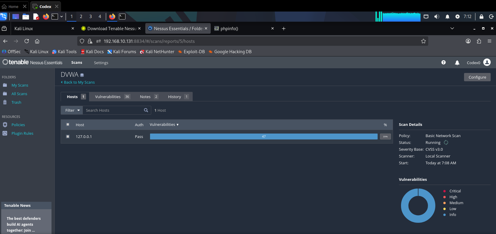

# 🛡️ Tenable Nessus — Vulnerability Assessment Lab

> A hands-on cybersecurity project demonstrating vulnerability scanning using **Tenable Nessus Essentials** on **Kali Linux**, targeting a deliberately vulnerable web application (**DVWA**) running inside Docker.

---

## 📋 Table of Contents

- [Overview](#overview)
- [Lab Architecture](#lab-architecture)
- [Prerequisites](#prerequisites)
- [Setup & Installation](#setup--installation)
  - [Step 1 — Download Tenable Nessus](#step-1--download-tenable-nessus)
  - [Step 2 — Start & Enable the Nessus Service](#step-2--start--enable-the-nessus-service)
  - [Step 3 — Access Nessus Web UI & Initialize](#step-3--access-nessus-web-ui--initialize)
  - [Step 4 — Install Docker & Deploy DVWA](#step-4--install-docker--deploy-dvwa)
- [Running the Vulnerability Scan](#running-the-vulnerability-scan)
  - [Step 5 — Configure a New Scan](#step-5--configure-a-new-scan)
  - [Step 6 — Review Scan Results](#step-6--review-scan-results)
- [Key Findings](#key-findings)
- [Remediation Recommendations](#remediation-recommendations)
- [Technologies Used](#technologies-used)
- [Disclaimer](#disclaimer)

---

## Overview

This project walks through a complete **vulnerability assessment workflow** using **Tenable Nessus Essentials** — the industry-standard vulnerability scanner. The goal is to:

1. Install and configure Nessus on a Kali Linux machine.
2. Deploy a vulnerable target application (**DVWA — Damn Vulnerable Web Application**) using Docker.
3. Perform a **Basic Network Scan** against the target.
4. Analyze the discovered vulnerabilities and severity levels.
5. Provide remediation recommendations based on the findings.

---

## Lab Architecture

```
┌─────────────────────────────────────────────────────────┐
│                    Kali Linux VM                        │
│                  IP: 192.168.10.131                     │
│                                                         │
│  ┌──────────────────┐      ┌──────────────────────┐    │
│  │  Tenable Nessus  │      │   Docker Container   │    │
│  │   Essentials     │─────▶│       DVWA            │    │
│  │  Port: 8834      │ scan │   Port: 80 → 80      │    │
│  │                  │      │   127.0.0.1           │    │
│  └──────────────────┘      └──────────────────────┘    │
└─────────────────────────────────────────────────────────┘
```

---

## Prerequisites

| Requirement | Details |
|---|---|
| **OS** | Kali Linux (or any Debian-based distro) |
| **Nessus Version** | Nessus Essentials 10.12.1 (free tier) |
| **Docker** | `docker.io` package |
| **Target** | DVWA (`vulnerables/web-dvwa`) |
| **Browser** | Firefox (or any modern browser) |
| **Account** | Free Tenable account for activation code |

---

## Setup & Installation

### Step 1 — Download Tenable Nessus

Navigate to the [Tenable Nessus Downloads](https://www.tenable.com/downloads/nessus) page. Select the appropriate version and platform:

- **Version:** Nessus - 10.12.1  
- **Platform:** Linux - Ubuntu - amd64


Install the downloaded `.deb` package:

```bash
sudo dpkg -i Nessus-10.12.1-ubuntu1604_amd64.deb
```

---

### Step 2 — Start & Enable the Nessus Service

Check the initial status of the Nessus service, then start and enable it:

```bash
# Check status (initially inactive)
sudo systemctl status nessusd

# Start the Nessus service
sudo systemctl start nessusd

# Verify it is running
sudo systemctl status nessusd
```


Enable the service so it starts automatically on boot:

```bash
sudo systemctl enable nessusd
```


---

### Step 3 — Access Nessus Web UI & Initialize

Open your browser and navigate to:

```
https://192.168.10.131:8834/
```

> **Note:** Replace the IP with your Kali machine's IP address. Accept the self-signed certificate warning.

Nessus will display a **Welcome / Setup** screen. Click **Continue** to proceed with the installation:


Register with your activation code obtained from [tenable.com](https://www.tenable.com/products/nessus/nessus-essentials). Nessus will then initialize and download the latest plugins:


---

### Step 4 — Install Docker & Deploy DVWA

Install Docker on the Kali machine:

```bash
sudo apt install docker.io -y
```


Start the Docker service:

```bash
sudo systemctl start docker
```


Verify Docker is running:

```bash
sudo systemctl status docker
```


Pull and run the **DVWA** container:

```bash
sudo docker run --rm -it -p 80:80 vulnerables/web-dvwa
```


Access DVWA in your browser at `http://127.0.0.1`:


---

## Running the Vulnerability Scan

### Step 5 — Configure a New Scan

In the Nessus web interface, create a new **Basic Network Scan** with the following settings:

| Setting | Value |
|---|---|
| **Name** | DVWA |
| **Description** | Test |
| **Folder** | My Scans |
| **Targets** | `127.0.0.1` |


---

### Step 6 — Review Scan Results

Once the scan completes, review the results in the **Hosts** tab:

- **Target:** `127.0.0.1`  
- **Policy:** Basic Network Scan  
- **Severity Base:** CVSS v3.0  
- **Scanner:** Local Scanner  
- **Vulnerabilities Found:** 47 (during scan)  
- **Authentication:** Pass ✅



Click into the host to view the detailed **vulnerability breakdown** (26 unique vulnerabilities identified):


---

## Key Findings

The scan discovered **26 vulnerabilities** across multiple categories:

| Severity | Count | Examples |
|---|---|---|
| 🔵 **Info** | 26 | Service Detection, HTTP Issues, TLS Issues |

### Notable Findings:

| # | Vulnerability | Family | Count |
|---|---|---|---|
| 1 | HTTP (Multiple Issues) | Web Servers | 4 |
| 2 | SSL (Multiple Issues) | General | 3 |
| 3 | TLS (Multiple Issues) | General | 2 |
| 4 | TLS (Multiple Issues) | Service detection | 2 |
| 5 | Service Detection | Service detection | 3 |
| 6 | MariaDB Client/Server Installed (Linux) | Databases | 2 |
| 7 | Netstat Portscanner (SSH) | Port scanners | 2 |
| 8 | Apache HTTP Server Version | Web Servers | 1 |

---

## Remediation Recommendations

| Finding | Recommendation |
|---|---|
| **HTTP Issues** | Enforce HTTPS, configure proper HTTP security headers (HSTS, CSP, X-Frame-Options) |
| **SSL/TLS Issues** | Disable deprecated protocols (SSLv3, TLS 1.0/1.1), use TLS 1.2+ with strong cipher suites |
| **Apache Version Disclosure** | Suppress version info via `ServerTokens Prod` and `ServerSignature Off` in Apache config |
| **MariaDB Exposure** | Restrict database access to localhost only, disable remote root login |
| **Service Detection** | Minimize exposed services, close unnecessary ports, implement firewall rules |

---

## Technologies Used

| Tool | Purpose |
|---|---|
| **Tenable Nessus Essentials** | Vulnerability scanning & assessment |
| **Kali Linux** | Penetration testing OS |
| **Docker** | Container platform for deploying targets |
| **DVWA** | Deliberately vulnerable web app for testing |
| **Firefox** | Web browser for accessing Nessus UI & DVWA |

---

## Disclaimer

> ⚠️ **This project is for educational and authorized testing purposes only.** Scanning systems without explicit permission is illegal and unethical. Always obtain proper authorization before performing vulnerability assessments. The DVWA target used in this lab is a deliberately vulnerable application designed for security testing in controlled environments.

---

<p align="center">
  <b>Made by <a href="https://github.com/Codexe0">Codex</a></b> 🔒
</p>
